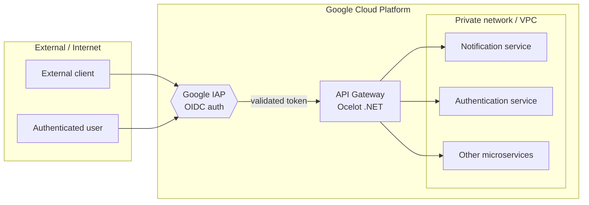

# API Gateway (.NET / Ocelot)

[](https://dotnet.microsoft.com/)
[](https://github.com/ThreeMammals/Ocelot)

An **API Gateway proof of concept** built with ASP.NET Core and [Ocelot](https://github.com/ThreeMammals/Ocelot), developed as a working POC for Grupo Prominente (client: **Apex**). It is a single, central entry point that receives external and authenticated requests, validates authentication, and routes them to internal microservices.

> **Note on ownership/license:** this is a POC produced for a client engagement. The code is shared here for demonstration and educational purposes; the intellectual property belongs to the client it was developed for.

---

## Table of contents

- [Architecture](#architecture)
- [How it works](#how-it-works)
- [Tech stack](#tech-stack)
- [Project structure](#project-structure)
- [Getting started](#getting-started)
- [Configuration](#configuration)
- [Deployment](#deployment)
- [Migration note](#migration-note)
- [License](#license)

---

## Architecture



The gateway is the **single entry point** for the platform:

- **External / internet requests** and **authenticated users** hit the gateway.
- **Authentication** (OIDC tokens via Google IAP, handled by the GCP infrastructure) is validated before a request is forwarded.
- Requests are then **routed to internal microservices** that live on a **private network** (the production version runs on a GCP VPC).

In the production setup hosted on GCP, placing the gateway in front of the microservices also **improved the latency** of requests to the downstream services.

---

## How it works

1. A request arrives at the gateway (`/gateway` path base) from an external source or an authenticated user.
2. The gateway relies on **JWT bearer authentication** for token validation.
3. Ocelot matches the request against `Routes` defined in `ocelot.{environment}.json` and proxies it to the matching **downstream microservice**.
4. The downstream service runs on the private network and never exposes its endpoints directly to the internet.

---

## Tech stack

| Layer | Technology |
|-------|------------|
| Runtime | .NET 10 (ASP.NET Core) |
| Gateway | [Ocelot](https://github.com/ThreeMammals/Ocelot) `25.0.0` |
| Auth | `Microsoft.AspNetCore.Authentication.JwtBearer` `10.0.3` (JWT) |
| Infra | Google Cloud Platform (App Engine Flex, VPC) |
| Protocol | HTTP/HTTPS routing |

---

## Project structure

```
apex-apigateway-ocelot/
├── Program.cs                         # Host bootstrap, loads ocelot.{env}.json
├── Startup.cs                         # DI: JWT auth, Ocelot + delegating handler
├── Handlers/
│   └── RemoveEncodingDelegatingHandler.cs  # Custom downstream handler
├── ocelot.json                        # Routes + downstream config
├── ocelot.{Environment}.json          # Per-environment route overrides
├── appsettings*.json                  # Per-environment app settings
└── app.yaml                           # GCP App Engine Flex descriptor (production VPC)
```

---

## Getting started

```bash
# Restore and run (requires .NET 10 SDK)
dotnet run --project apex-apigateway-ocelot

# Build (Debug or Release)
dotnet build apex-apigateway-ocelot.sln -c Release

# Run with an explicit environment (loads the matching ocelot.{env}.json)
$env:ASPNETCORE_ENVIRONMENT="Local"
dotnet run --project apex-apigateway-ocelot
```

The gateway listens on `http://localhost:5000` by default and serves requests under the `/gateway` path base.

> **Local note:** the per-environment route files point at the client's sandbox/GCP endpoints, which may not be reachable from outside their environment. To test locally, update the `DownstreamHostAndPorts` of the routes you care about to a local downstream (e.g. `localhost`) as shown in the `ocelot.json` example.

---

## Configuration

Routes are declared per environment so the same gateway can route differently in each stage:

| File | Purpose |
|------|---------|
| `ocelot.json` | Default / example routes |
| `ocelot.Development.json` | Local development |
| `ocelot.Local.json` | Local sandbox |
| `ocelot.Testing.json` | QA / testing |
| `ocelot.Production.json` | Production endpoints (private VPC) |

Each route maps an **upstream path** (what external callers use) to a **downstream host/path** (the internal microservice), plus HTTP method, scheme, and an optional `SwaggerKey`.

```json
{
  "UpstreamPathTemplate": "/api/EmailNotification",
  "UpstreamHttpMethod": [ "Post" ],
  "DownstreamScheme": "https",
  "DownstreamHostAndPorts": [
    { "Host": "<downstream-service>" }
  ],
  "DownstreamPathTemplate": "/api/EmailNotification"
}
```

---

## Deployment

The POC ships with a Google App Engine **Flexible** descriptor (`app.yaml`) configured for the **Production** environment:

- `runtime: aspnetcore`, `env: flex`
- `ASPNETCORE_ENVIRONMENT: Production`
- Binds the gateway to the private **production VPC** subnet (`gcp-apps-prod-vpc`)
- Non-prod networks (dev/QA) are provided as commented-out templates

```
gcloud app deploy app.yaml
```

---

## Migration note

The historical source used **.NET Core 3.1** (Ocelot 16, JwtBearer 3.1), which reached end of life. This repository migrates the POC to **.NET 10**:

- `netcoreapp3.1` → `net10.0`
- Ocelot `16.0.1` → `25.0.0`
- JwtBearer `3.1.20` → `10.0.3`

**Removed:** `MMLib.SwaggerForOcelot`. Its Swashbuckle 10.x integration cannot construct `SwaggerGenerator` on .NET 10 and blocks startup. Aggregated downstream Swagger UI is an accessory; the Ocelot routing and JWT auth remain the core of the gateway.

---

## License

Proof of concept developed for Grupo Prominente (client: **Apex**). All rights belong to the client; no license is granted for commercial reuse. See the [architecture notes in the Wiki](../../wiki) for more detail.
